# DCPP - **D**evOps **C**ore **P**ractical **P**roject

## INTRODUCTION
**Martin Glenn Taylor** 
(_definiately the oldest member of the cohort!_)

 

## Content
1. Background
2. The "Game"
3. Project Management
4. Risk Assessment 
5. Techincal Design
6. CI/CD
7. Unit Tests
8. Development Repository Structure
9. Further Developement

## Background
The DevOps Core Practical project is supposed to display our skills in the use of DevOps technologies, CI/CD techniques, deploy tools and working strategies. It has been stated that this assessment does not concentrate on the actual program being deployed, rather the methods used to automatically install the application on the target hosts.

To that extent, the project must demonstrate, the use of:
* Multiple Micro Service Architecture, running on a number of disperate VMs.
* The use of GITHUB as a code repository.
* JENKINS as a CI/CD manager - pipeline triggered by a GIT/Jenkins Webhook
* DOCKER as a containerisation tool.
* DOCKER=COMPOSE as a deployment tool.
* DOCKER-SWARM as a hosting platform technology of choice.
* ANSIBLE as a configuration management tool.
* Data perssisted to a MySQL Database.
* The deployment and use of a Front End / Load-Balancer.

The project must also include:
* A sample of the JIRA Board used during the application life cycle.
* A simple ERD of the MySQL data stored.
* A Risk Assessement.

I have included a link to the GITHUB repository: [Link to DCPP GITHUB Repo](https://github.com/martingtaylor/dcpp)

## The "Game"
The appilcation is a simple Cannon Ball / Target game. The user presses the fire button and a randon Elevation Angle and Muzzle velocity are generated, then the distance the cannon ball travels is calculated using the simplistic formula:

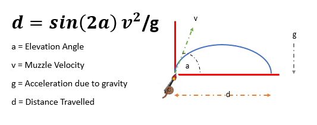

The distance from a 1000 meter target if then calculated and a ranking and message (sometimes rude!) generated:

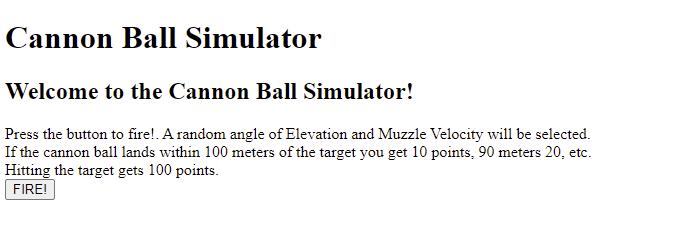

Pressing the fire button, fires the cannon ball and generates a score. The last 10 attempts are then displayed.

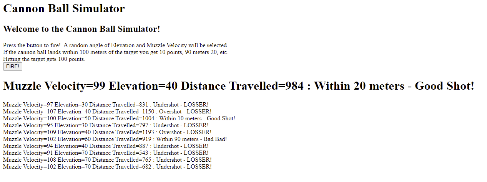

## Project Manager
The JIRA Project Management tool was used to track and manage the application during the development, testing deployment cycle:
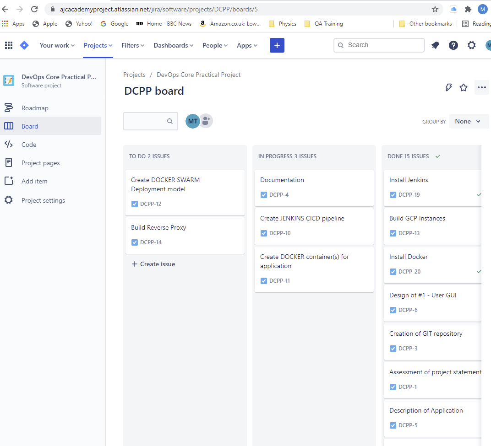

**NOTE:** The above graphic may not be an accurate reflection of the curreny JIRA tickets.

The current JIRA configuration allows:

Management of the "To-Do list" - user stories, summarising "Who Wants", "What they Want" and "What they except"

The "In progress" - containing items currently being worked on, or blocked items.

The "Done List" - Items that have been completed and tested, or approved.

## Risk Assessment
An initial Risk Assessment was completed on project commencement:
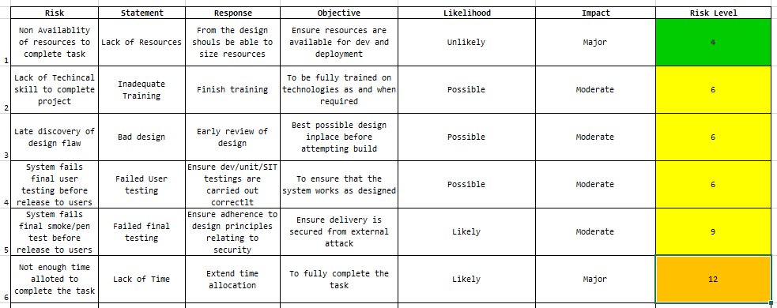

### Risk Assessment Revision
The following revisions where applied to the initial Risk Assessment:

**NO Ammendments made to the Risk Assessment**

## Techincal Design
### Recap of functional Design:
* The user GUI is managed from a micro service, which displays a simple HTML screen, containg a single Fire Button.

* Pressing the fire button invokes a another micro service to select a random angle of elevation from defined list.

* Another service generates the muzzle velocity from a defined range.

* The angle and velocity are sent to third service, which calculates the distance travalled and how close to a 1000 meter target the cannon balls land. This score is then ranked; from a direct hit scoring a BULLS EYE, and then in 10 meter inetrvals, giving an increaing rude response message.

* The complete set of data (angle, velocity and message), is persisted to a MySQL database, and the last 10 entries displayed under the latest result.

### Architecture Overview:
The application is based on four seperate, python based services:
|Service|Description|
|-------|-----------|
|APP1   |Main GUI, reporting and trigger button. Write APP4 results to MySQL Database|
|APP2   |Service that returns a randomly selected elevation angle|
|APP3   |Service that returns a randomly selected muzzle velocity|
|APP4   |Service that accepts the elevation and velocity, calculate the distance travelled and allocates a score and comment.

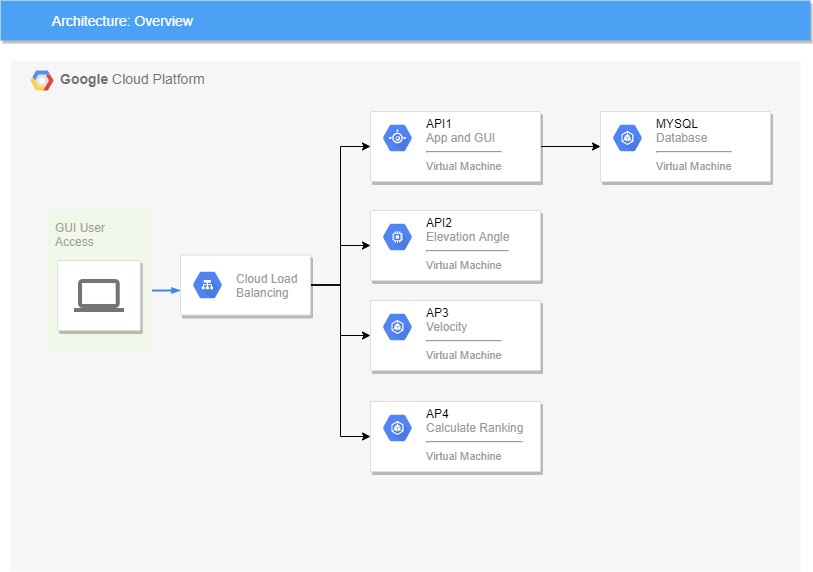

**APP1** is responsible for recording the details of the firing to a table within a MYSQL database. The is database is a single table containing:

### Database Design:
The results of a firing are perssisted to:
* A MySQL Database, running on a seperate VM
* A Database, called **cannonball**
* A single table called **record_fires**

The **record_fires** table contains the following fields:
|Column|Type|Description|
|------|----|-----------|
|id       |Integer, Not Null|Row Identifier and Primary Key|
|velocity |Integer, Not Null|Muzzle Velocity|
|elevation|Integer, Not Null|Elevation Angle|
|result   |String(200), Not Null|Resultant text (details + ranking) from APP4|

### ERD:
A simple ERD disagram for this table:

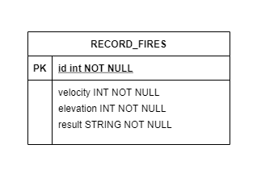

### Deployment Design:
The application has to demonstrate:
* Basic Security isolation via a Reverse Proxy.
* Load-Balancing and multi container deployment, using DOCKER containers and a SWARM installation, running on a small network of a single Manger and Worker node.

### VM Instances
The following VM Instances were created to host the application:
|Instance|Type|Description|
|--------|----|-----------|
|dcppdatabase|MySQL| Database server, used to store previous firings details|
|dcpp-docker|VM e2-small|Jenkins, Docker, Ansible Server|
|dcpp-manager|VM e2-medium|Docker Swarm Manager|
|dcpp-worker|VM e2-medium|Docker Swarm Worker|
|dcpp-nginx|VM e2-micro|Load Balancer|

## CI/CD
The appilcation was developed in **Python**, using **Microsoft Visual Studio** as an IDE, employing **GITHUB** as a code repository. During the development process, regular updates where posted to the GIT DEV branch.

### GITHUB Repo
The Repo also contained:
|File|Description|
|----|-----------|
|Jenkinsfile|Containing the pipeline to:  test, build, **DOCKER HUB** upload and deploy the a **DOCKER SWARM**|
|Dockerfiles|To build each service|
|docker-compose|Docker Compose build yaml files|
|Requerments.txt|Requerements for each service|
|README.md|Application documentation|
|Documents|Other documents and images|
|Unit tests|Unit tests for each APP|
|Ansible|Playbooks and Inventories|

### GITHUB -> Jenkins WEBHOOK
A _Webhook_ was attached to the GIT DEV branch, (it will later be moved to Main branch, if and when the application goes into production!!). The __Webhook__ triggered the automatic CD/CI pipline.

### Overview of the CI/CD process:
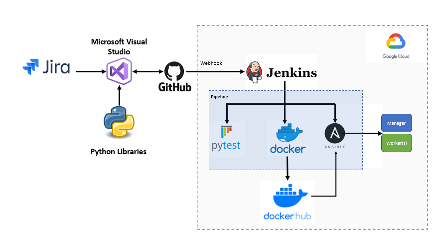

On a **push** to **Github**, a _Web-Hook_ triggers a Jenkins pipeline, that:
1. Pulls the application from the GIT Repo.
2. Run a requirments install.
2. Runs PYTEST against the all the APP code:
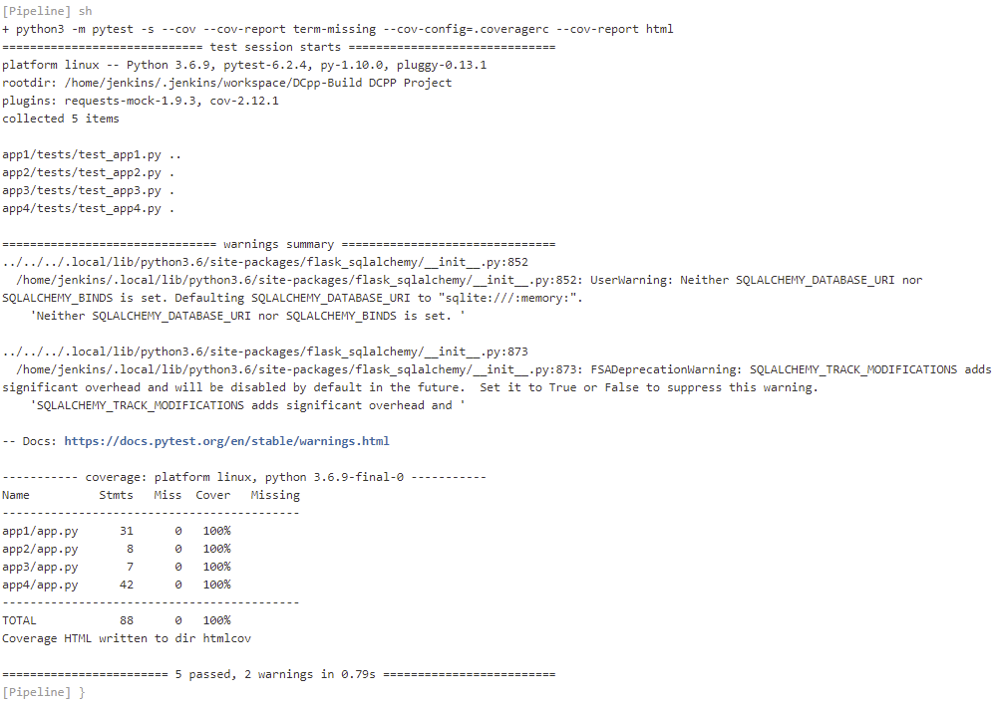
3. **DOCKER-COMPOSE** then creates images for each service.
4. Uploads the new images to **DOCKERHUB**. (Login credentials are stored within Jenkins secrets manager.)
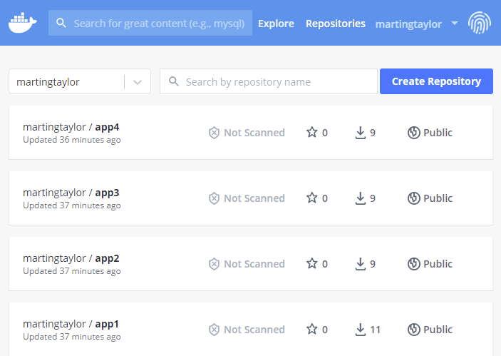
5. **Ansible** used to build a **DOCKER SWARM**, referencing to the services stored in **DOCKER HUB**
6. **DOCKER STACK** then build the Load-Balancer **NGINX**.

Finally, **Jenkins** displays:
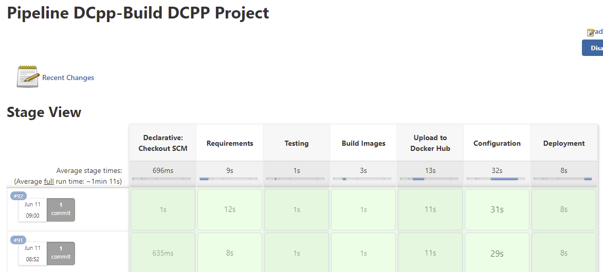

## Unit Tests
The following unit test chases where created:
1. APP1 - That the GUI returns the correcy message as a result of calling the sub components.
2. APP2 - Test that the complete range of Elevation Angles are tested.
3. APP3 - Test that the complete range of Muzzle Velocities are tested.
4. APP4 - Test that validate distances and rankings for combination of Elevation Angles and Muzzle Velocities properly calculated.

|Service|Test|Description|
|-------|----|-----------|
|APP1   |Assert200   |Access to access "/"|
|       |AssertIn    |Mock Request for APP2, APP3 and APP4, to exercise APP2 request|
|APP2   |Assert200   |Access to elevation service|
|       |AssertIn    |Validate return value|
|APP3   |Assert200   |Access to veloicity service|
|       |AssertIn    |Validate return value|
|APP4   |Assert200   |13 tests for each ranking message (Over/Under shoot, Bulls Eye, 10 Ranings|

The **PYTEST** command used was:

     python -m pytest -s --cov --cov-report term-missing --cov-config=.coveragerc --cov-report html

Happly able to validate 100% coverage:
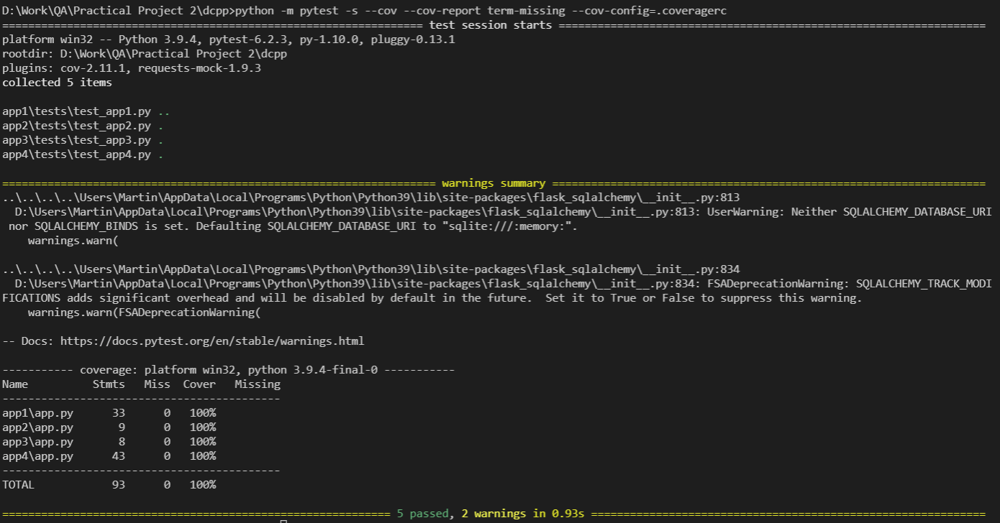

Coverage HTMLs where generated and saved to GIT:

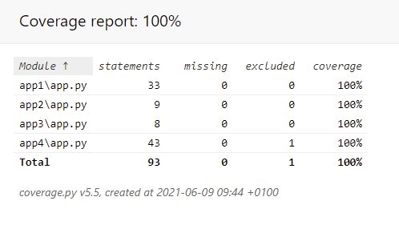

**NOTE:** Given time, I would have added a further test to check that an entry is being made to the database, by query the results from the table following a write.

## Development Repository Structure
I have included the current Development Directory Structure:
<pre>
dcpp
├── JenkinsTest.PNG
├── Jenkinsfile
├── README.md
├── ansible
│   ├── inventory.yaml
│   ├── playbook.yaml
│   └── roles
│       ├── docker
│       │   ├── README.md
│       │   ├── defaults
│       │   │   └── main.yml
│       │   ├── handlers
│       │   │   └── main.yml
│       │   ├── meta
│       │   │   └── main.yml
│       │   ├── tasks
│       │   │   └── main.yml
│       │   ├── tests
│       │   │   ├── inventory
│       │   │   └── test.yml
│       │   └── vars
│       │       └── main.yml
│       ├── manager
│       │   ├── README.md
│       │   ├── defaults
│       │   │   └── main.yml
│       │   ├── handlers
│       │   │   └── main.yml
│       │   ├── meta
│       │   │   └── main.yml
│       │   ├── tasks
│       │   │   └── main.yml
│       │   ├── tests
│       │   │   ├── inventory
│       │   │   └── test.yml
│       │   └── vars
│       │       └── main.yml
│       └── worker
│           ├── README.md
│           ├── defaults
│           │   └── main.yml
│           ├── handlers
│           │   └── main.yml
│           ├── meta
│           │   └── main.yml
│           ├── tasks
│           │   └── main.yml
│           ├── tests
│           │   ├── inventory
│           │   └── test.yml
│           └── vars
│               └── main.yml
├── app1
│   ├── Dockerfile
│   ├── README.md
│   ├── app.py
│   ├── create.py
│   ├── requirements.txt
│   ├── templates
│   │   └── index.html
│   └── tests
│       └── test_app1.py
├── app2
│   ├── Dockerfile
│   ├── README.md
│   ├── app.py
│   ├── requirements.txt
│   └── tests
│       └── test_app2.py
├── app3
│   ├── Dockerfile
│   ├── README.md
│   ├── app.py
│   ├── requirements.txt
│   └── tests
│       └── test_app3.py
├── app4
│   ├── Dockerfile
│   ├── README.md
│   ├── app.py
│   ├── requirements.txt
│   └── tests
│       └── test_app4.py
├── docker-compose.yaml
├── documents
│   └── dcpp_CDCI.pptx
├── htmlcov
├── images
├── nginx
│   └── nginx.conf
├── requirements.txt
├── risk_assessment
│   └── DCPP-risk-assessment.xlsx
└── runpytest.bat
</pre>

## Further Development
1. I have installed all Jenkins, Docker and Ansible all on the same VM instance. I would like to break these into a seperate Jenkins server.
2. I need to revisit the requirements.txt file used for the deployment, and make some of these modules optional per installation type.
3. Extend Unit Testing to include Database Insertion.
4. Make the application a little more interesting that it is!

