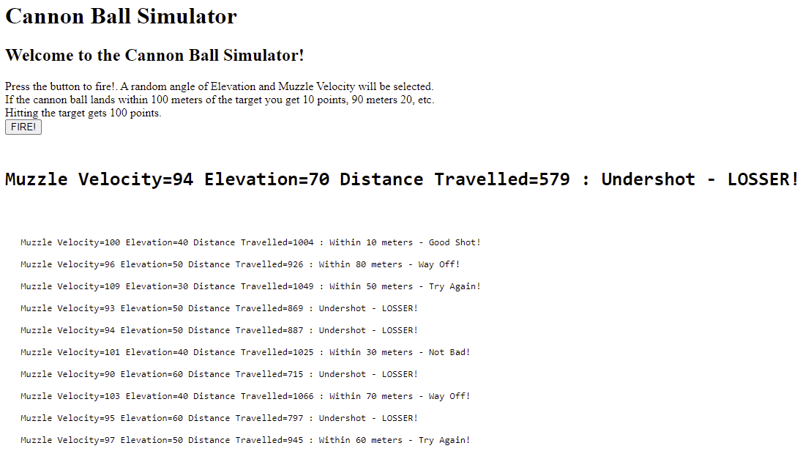

# DCPP - **D**evOps **C**ore **P**ractical **P**roject

## Content
1. Background
2. The "Game"
3. Techincal Design
4. CI/CD
5. Unit Tests
6. Risk Assessment 
7. Project Management

## Background
The DevOps Core Practical project is supposed to display our skills in the use of DevOps technologies, CI/CD techniques, deploy tools and working strategies. It has been stated that this assessment does not concentrate on the actual program being deployed, rather the methods used to automatically install the application on the target hosts.

To that extent, the project must demonstrate, the use of:
* JENKINS and a CI/CD manager.
* DOCKER as a containerisation tool.
* DOCKER-SWARM as a deploy technology of choice.
* ANSIBLE as a configuration management tool.
* Data perssisted to a MySQL Database.
* The deployment and use of a Load-Balancer.

The project must also include:
* A sample of the JIRA Board used during the application life cycle.
* A simple ERD.
* A Risk Assessement.

GITHUB has been used as a code repository: [Link to DCCP GITHUB Repo](https://github.com/martingtaylor/dcpp)

## The "Game"
The appilcation is a simple Cannon Ball / Target game. The user presses the fire button and a randon Elevation Angle and Muzzle velocity are generated, then the distance the cannon ball travels is calculated using the simplistic formula:

The distance form a 1000 meter target if then calculated and a ranking and message (sometimes rude!) generated.

When accessed the screen displays:

Pressing the fire button, fires the cannon ball and generates a score. The last 10 attempts are then displayed.

## Techincal Design
Pressing  the fire button causes a simple service select an angle of cannon elevation from defined list, another service generates the muzzle velocity of the cannon ball from a defined rane.

The angle and velocity are sent to third service which calculates the distance travlle and how close to a 100 meter target the cannon balls land. This score is then rank from a direct hit scoring a BULLS EYE, in 10 meter inetrvals, giving an increaing rude message.

The complete set of data (angle, velocity and message), is persisted to a MySQL database, and the last 10 entries displayed under the latest result.

The application is based on four seperate, python based services:
|Service|Description|
|-------|-----------|
|APP1   |Main GUI, reporting and trigger button. Write APP4 results to MySQL Database|
|APP2   |Service that returns a randomly selected elevation angle|
|APP3   |Service that returns a randomly selected muzzle velocity|
|APP4   |Service that accepts the elevation and velocity, calculate the distance travelled and allocates a score and comment.

**APP1** is responsible for recording the details of the firing to a table within a MYSQL database. The is database is a single table containing:

|Column|Type|Description|
|------|----|-----------|
|id       |Integer, Not Null|Row Identifier and Primary Key|
|velocity |Integer, Not Null|Muzzle Velocity|
|elevation|Integer, Not Null|Elevation Angle|
|result   |String, Not Null|Resultant text (details + ranking) from APP4|

### ERD:
A simple ERD disagram for this table:

### VM Instances
The following VM Instances were created to host the application:
|Instance|Type|Description|
|--------|----|-----------|
|dcppdatabase|MySQL| Database server, used to store previous firings details|
|dcpp-docker|VM e2-small|Jenkins, Docker, Ansible Server|
|dcpp-manager|VM e2-medium|Docker Swarm Manager|
|dcpp-worker|VM e2-medium|Docker Swarm Worker|
|dcpp-nginx|VM e2-micro|Load Balancer|

## CI/CD
The appilcation was developed in **Python**, using **Microsoft Visual Studio** as an IDE, and employing **GITHUB** as a code repository. During the development process, regular updates where posted to the GIT DEV branch.

### GITHUB Repo
The Repo also contained:
|File|Description|
|----|-----------|
|Jenkinsfile|Containing the pipeline to:  test, build, **DOCKER HUB** upload and deploy the a **DOCKER SWARM**|
|Dockerfiles|To build each service|
|docker-compose.yaml|Docker Compose build script|
|Requerments.txt|Requerements for each service|
|README.md|Application documentation|
|Documents|Other documents and images|

### GITHUB -> Jenkins WEBHOOK
A _Web-hook_ was attached to the GIT DEV branch, (it will alter be moved to Main branch, if and when the application goes into production!!) which triggered the automatic CD/CI cycle

### Overview of the CI/CD process:

On a **push** to **Github**, a _Web-Hook_ triggers a Jenkins pipeline, that:
1. Pulls the application from the GIT Repo.
2. Run a requirments install.
2. Runs PYTEST against the new code:

3. Runs the DOCKER-COMPOSE to create images for each service.
4. Uploads the new images to DOCKERHUB. (Login credentials are stored within Jenkins secrets manager.)

5. **Ansible** used to build a **DOCKER SWARM**, referencing to the services stored in **DOCKER HUB**
6. **Ansible** then build the Load-Balancer **NGINX**.
6. Jenkins then completes the installation by building the stack.

## Unit Tests
The following unit test where created:
|Service|Test|Description|
|-------|----|-----------|
|APP1   |Assert200   |Access to access "/"|
|       |AssertIn    |Mock request for APP2, APP3 and APP4, to exercise APP2 request|
|APP2   |Assert200   |Access to elevation service|
|       |AssertIn    |Validate return value|
|APP3   |Assert200   |Access to veloicity service|
|       |AssertIn    |Validate return value|
|APP4   |Assert200   |13 tests for each ranking message (Over/Under shoot, Bulls Eye, 10 Ranings|

The **PYTEST** command used was:

     python -m pytest -s --cov --cov-report term-missing --cov-config=.coveragerc --cov-report html

Happly able to validate 100% coverage:

Coverage HTML where generated and saved to GIT:

## Risk Assessment
An initial Risk Assessment was completed on project commencement:

### Risk Assessment Revision
The following revisions where applied to the initial Risk Assessment:

## Project Manager
The JIRA Project Management tool was used to track and manage the application during the development, testing deployment cycle:

**NOTE:** The above graphic may not be an accurate reflection of the curreny JIRA tickets.

The current JIRA configuration allows:

Management of the "To-Do list" - user stories, summarising "Who Wants", "What they Want" and "What they except"

The "In progress" - containing items currently being worked on, or blocked items.

The "Done List" - Items that have been completed and tested, or approved.